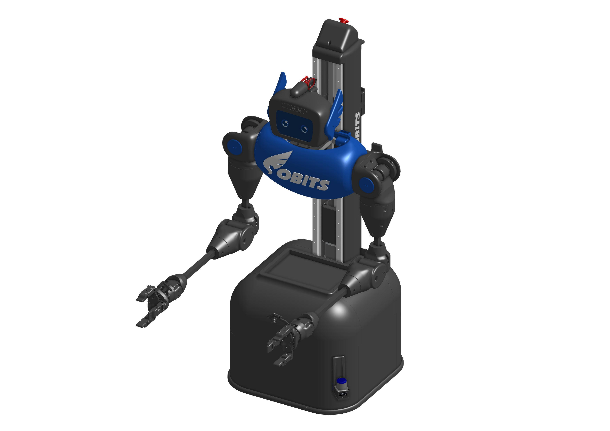
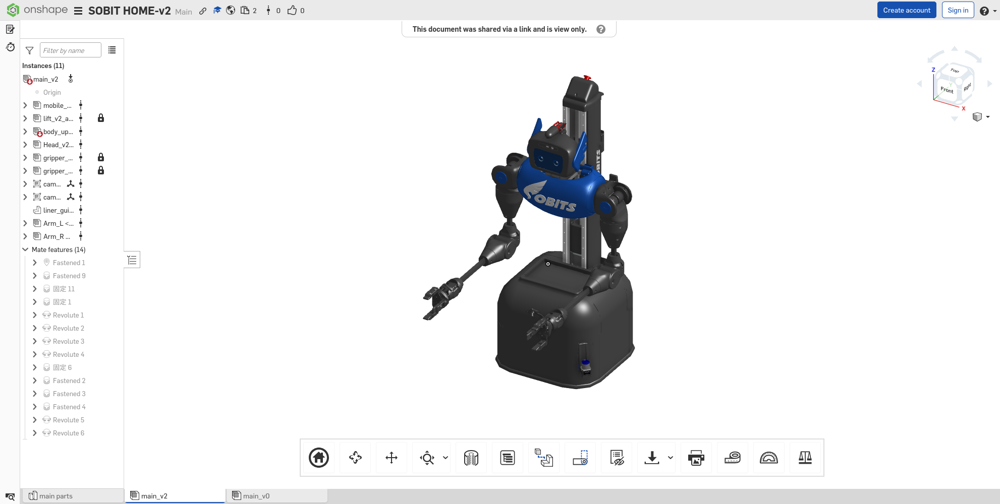
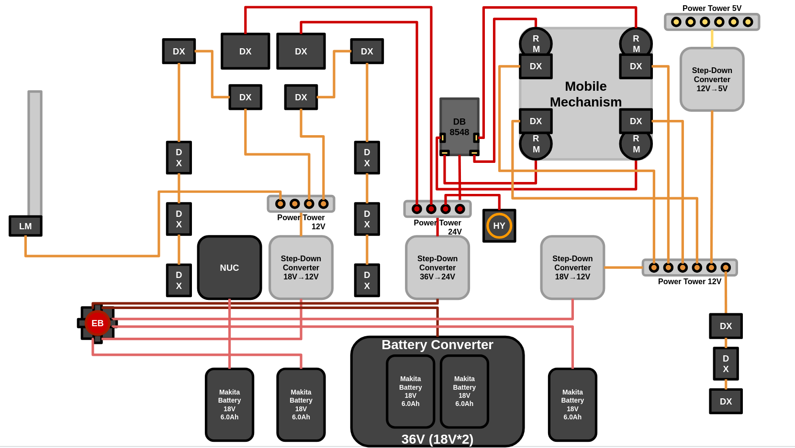

<a name="readme-top"></a>

[JA](README_ja.md) | [EN](README.md)

[![Contributors][contributors-shield]][contributors-url]
[![Forks][forks-shield]][forks-url]
[![Stargazers][stars-shield]][stars-url]
[![Issues][issues-shield]][issues-url]
[![License][license-shield]][license-url]

# SOBIT HOME


<!-- INTRODUCTION -->
## Introduction



This package is for operating the SOBITS custom mobile manipulator, which combines a four-wheel independent steering drive mechanism, a lift mechanism, dual arms, and a pan-tilt mechanism.

> [!CAUTION]
> If you have no previous experience controlling this robot, please have a senior colleague accompany you while you want to use this robot.

<p align="right">(<a href="#readme-top">back to top</a>)</p>


<!-- GETTING STARTED -->
## Getting Started

This section describes how to set up this repository.

<p align="right">(<a href="#readme-top">back to top</a>)</p>


### Prerequisites

First, please set up the following environment before proceeding to the next installation stage.

| System  | Version |
| --- | --- |
| Ubuntu | 24.04 (Noble Numbat) |
| ROS    | Jazzy Jalisco |
| Python | 3.12 |
| Docker | latest |

> [!NOTE]
> If you need to install `Ubuntu` or `ROS`, please check our [SOBITS Manual](https://github.com/TeamSOBITS/sobits_manual#%E9%96%8B%E7%99%BA%E7%92%B0%E5%A2%83%E3%81%AB%E3%81%A4%E3%81%84%E3%81%A6).

<p align="right">(<a href="#readme-top">back to top</a>)</p>


### Installation

1. Go to the `src` folder of ROS.
    ```sh
    $ cd ~/colcon_ws/src/
    ```

2. Clone this repository.
    ```sh
    $ git clone https://github.com/TeamSOBITS/sobit_home
    ```

3. Navigate into the repository.
    ```sh
    $ cd sobit_home/
    ```

4. Install the dependent packages.
    ```sh
    $ bash install.sh
    ```

5. Setup Rust for `rm_motors_ros` before compiliing.
    ```sh
    source $HOME/.bashrc

    cd ~/colcon_ws/src/rm_motors_ros/rm_motors_hw/rm_motors_can
    cargo install cargo-expand
    cargo build --release
    ```

6. Compile the package.
    ```sh
    $ cd ~/colcon_ws/
    $ colcon build --symlink-install
    $ source ~/colcon_ws/install/setup.sh
    ```

<p align="right">(<a href="#readme-top">back to top</a>)</p>


<!-- LAUNCH AND USAGE EXAMPLES -->
## Launch and Usage

1. Select features with launch arguments and execute [real_minimal.launch.py](sobit_home_bringup/launch/real_minimal.launch.py) in your **development environment**.
    ```sh
    $ ros2 launch sobit_home_bringup real_minimal.launch.py
    ```

2. You can enable/disable modules directly from CLI (recommended).
    ```sh
    $ ros2 launch sobit_home_bringup real_minimal.launch.py \
      enable_mobile_base:=true \
      enable_body:=true \
      enable_arm_left:=true \
      enable_arm_right:=false \
      enable_head:=true \
      enable_lidar:=true \
      use_rviz:=true
    ```

3. For real hardware mode, load `.bashrc` and set SOBIT HOME domain before launch.
    ```sh
    $ source ~/.bashrc
    $ sobit_home_mode
    ```

If you did not succeed in connecting to the real robot, check the following points:
- Ensure the emergency stop button is not pressed.
- Verify the battery is sufficiently charged.
- Confirm the USB hub is connected to the computer.
- Verify that required environment variables are set in your shell (`DXL_X_LOWER_PORT`, `DXL_X_UPPER_PORT`, `DXL_P_UPPER_PORT`, `UM_PORT`, `HOME_CAM_LEFT_PORT`, `HOME_CAM_RIGHT_PORT`).
- Verify CAN is available (`can0`) when `enable_mobile_base:=true`.

<p align="right">(<a href="#readme-top">back to top</a>)</p>


<!-- CONTROL NOTES -->
## Control Notes

### Wheel Controller

`move_wheel_linear` drives the robot straight by a target distance (metres). `move_wheel_rotate` turns in place by a target angle (radians). Both actions use closed-loop PID feedback from odometry and clamp velocity near the goal for smooth stopping. Gains can be tuned at runtime via ROS parameters — no recompile needed.

### Swerve Drive

The four-wheel independent steering controller computes per-wheel steer angle and drive velocity from any combination of `cmd_vel` components (x, y, θ). It automatically picks the shortest steering path for each wheel, reversing the drive direction when that is faster than a full rotation.

### MoveIt Integration

`plan_to_pose` plans a trajectory for the given planning group (`arm_left`, `arm_right`, `arm_left_body`, `arm_right_body`) and caches it. `execute_plan` replays the cached trajectory. For whole-body groups (`arm_left_body`, `arm_right_body`), the base is moved in parallel with the arm via the `MoveItWholeBodyBridge`, which tracks the planned base waypoints using odometry feedback.

All MoveIt interfaces work correctly in both real-hardware and Gazebo simulation modes, including when the simulator is paused.

<p align="right">(<a href="#readme-top">back to top</a>)</p>


### Visualize on Rviz2

As a preliminary step to running the actual machine, SOBIT HOME can be visualized on Rviz to display the robot's configuration.

```sh
$ ros2 launch sobit_home_description display.launch.py
```

<!-- If it works correctly, Rviz will be displayed as follows.
 -->

<p align="right">(<a href="#readme-top">back to top</a>)</p>


### Run on Gazebo Sim

SOBIT HOME has a simulation environment with Gazebo Harmonic, allowing you to verify operations even without the actual machine.

```sh
$ ros2 launch sobit_home_bringup gz_minimal.launch.py
```

At present, the following virtual environments are available.

| World Name   | Description |
| ------------ | ----------- |
| `empty`        | Spawns an environment without furniture or obstacles. |
| `wrs`          | Spawns the Tidy Up environment used in WRS2020. |
| `small_house`  | Spawns a small house layout developed by AWS. |
| `rcjo2025_arena` | Spawns the RCJ Open 2025 arena world. |
| `rcjo2026_arena` | Spawns the RCJ Open 2026 arena world (default). |

To change the environment, modify the `world_model` parameter in [gz_minimal.launch.py](sobit_home_bringup/launch/gz_minimal.launch.py).

```sh
$ ros2 launch sobit_home_bringup gz_minimal.launch.py world_model:=empty
```

<!-- If it works correctly, the following Gazebo screen will be displayed.
 -->

> [!TIP]
> Since it is equipped with sensors similar to the actual machine, the processing may become heavy depending on the computer. Please select only the necessary sensors in [gz_minimal.launch.py](sobit_home_bringup/launch/gz_minimal.launch.py).

```python
'enable_head_cam_color'       : 'true',
'enable_head_cam_depth'       : 'true',
'enable_hand_left_cam_color'  : 'true',
'enable_hand_right_cam_color' : 'true',
'enable_lidar'                : 'true',
```

Additionally, multiple SOBIT HOMEs can be spawned in the same simulation environment by launching additional instances with different `robot_id` and spawn coordinates.

```sh
# Robot 1
$ ros2 launch sobit_home_bringup gz_minimal.launch.py \
  robot_name:=sobit_home robot_id:=1 robot_coords_x:=0.0 robot_coords_y:=0.0 robot_coords_Y:=0.0

# Robot 2
$ ros2 launch sobit_home_bringup gz_minimal.launch.py \
  robot_name:=sobit_home robot_id:=2 robot_coords_x:=0.0 robot_coords_y:=2.0 robot_coords_Y:=0.0
```

<p align="right">(<a href="#readme-top">back to top</a>)</p>


## Software

### Package Overview

| Package | Role | Main Entry Points |
| --- | --- | --- |
| `sobit_home_bringup` | Integrated startup for real robot and Gazebo | `launch/real_minimal.launch.py`, `launch/gz_minimal.launch.py`, `launch/robot.launch.py` |
| `sobit_home_control` | Swerve base control and MoveIt whole-body bridge | `swerve_controller_node`, `moveit_whole_body_bridge_node` |
| `sobit_home_library` | High-level action/service servers (joint, wheel, MoveIt) | `launch/action_server.launch.py`, `joint_action_server`, `wheel_action_server`, `moveit_action_server` |
| `sobit_home_description` | URDF/Xacro model, RViz config, and base world file | `launch/display.launch.py`, `robots/sobit_home_robot.urdf.xacro` |
| `sobit_home_moveit_config` | MoveIt planning configuration and launch | `launch/move_group.launch.py` |
| `sobit_home_kinematics_plugin` | MoveIt kinematics plugin for SOBIT HOME | `sobit_home_kinematics_plugin_description.xml` |

<details>
<summary>Summary of information on SOBIT HOME and related software</summary>


### Joint Controller

This is a summary of information for moving the joints (pan-tilt mechanism, linear mechanism and manipulator) of SOBIT HOME.

<p align="right">(<a href="#readme-top">back to top</a>)</p>


#### Movement Methods

Implemented interfaces in `sobit_home_library`:

1. Actions
   - `move_joint`
   - `move_to_pose`
   - `move_right_hand_to_pose`
   - `move_left_hand_to_pose`

2. Services
   - `get_hand_to_coord/left`
   - `get_hand_to_coord/right`
   - `get_hand_to_tf/left`
   - `get_hand_to_tf/right`
   - `get_head_to_coord`
   - `get_head_to_tf`
   - `get_finger_angle`

3. MoveIt interfaces (launched from `action_server.launch.py`)
   - Service: `plan_to_pose`
   - Action: `execute_plan`

<p align="right">(<a href="#readme-top">back to top</a>)</p>


#### Joints name

The joint names of SOBIT HOME and their constants are listed below.

| Joint Number | Joint Name | Joint Constant Name |
| :---: | --- | --- |
|  0 | head_pan_joint                | - |
|  1 | head_tilt_joint               | - |
|  2 | arm_left_shoulder_tilt_joint  | - |
|  3 | arm_left_upper_roll_joint     | - |
|  4 | arm_left_upper_flex_joint     | - |
|  5 | arm_left_elbow_joint          | - |
|  6 | arm_left_wrist_tilt_joint     | - |
|  7 | arm_left_wrist_roll_joint     | - |
|  8 | arm_right_shoulder_tilt_joint | - |
|  9 | arm_right_upper_roll_joint    | - |
| 10 | arm_right_upper_flex_joint    | - |
| 11 | arm_right_elbow_joint         | - |
| 12 | arm_right_wrist_tilt_joint    | - |
| 13 | arm_right_wrist_roll_joint    | - |
| 14 | hand_left_finger_l_mcp_joint  | - |
| 15 | hand_left_finger_l_pip_joint  | - |
| 16 | hand_left_finger_l_dip_joint  | - |
| 17 | hand_left_finger_c_mcp_joint  | - |
| 18 | hand_left_finger_c_ip_joint   | - |
| 19 | hand_left_finger_r_pip_joint  | - |
| 20 | hand_left_finger_r_dip_joint  | - |
| 21 | hand_right_finger_l_mcp_joint | - |
| 22 | hand_right_finger_l_pip_joint | - |
| 23 | hand_right_finger_l_dip_joint | - |
| 24 | hand_right_finger_c_mcp_joint | - |
| 25 | hand_right_finger_c_ip_joint  | - |
| 26 | hand_right_finger_r_pip_joint | - |
| 27 | hand_right_finger_r_dip_joint | - |
| 28 | body_lift_joint               | - |
| 29 | wheel_steer_f_l_joint         | - |
| 30 | wheel_steer_f_r_joint         | - |
| 31 | wheel_steer_b_l_joint         | - |
| 32 | wheel_steer_b_r_joint         | - |
| 33 | wheel_drive_f_l_joint         | - |
| 34 | wheel_drive_f_r_joint         | - |
| 35 | wheel_drive_b_l_joint         | - |
| 36 | wheel_drive_b_r_joint         | - |

<p align="right">(<a href="#readme-top">back to top</a>)</p>


#### How to set new poses

Poses can be added and edited in the file [pose_list.yaml](sobit_home_library/config/pose_list.yaml). The format is as follows:

```yaml
/**:
  ros__parameters:
    poses:
      - initial_pose
      - detecting_pose

    initial_pose:
      body_lift               : 0.5
      head_pan                : 0.0
      head_tilt               : 0.0
      arm_left_shoulder_tilt  : 0.0
      arm_left_upper_roll     : 0.0
      arm_left_upper_flex     : 0.0
      arm_left_elbow          : 0.0
      arm_left_wrist_tilt     : 0.0
      arm_left_wrist_roll     : 0.0
      arm_right_shoulder_tilt : 0.0
      arm_right_upper_roll    : 0.0
      arm_right_upper_flex    : 0.0
      arm_right_elbow         : 0.0
      arm_right_wrist_tilt    : 0.0
      arm_right_wrist_roll    : 0.0
...
```  

Add the desired pose name to `poses`, and then set the angles for each joint under the pose name.

<p align="right">(<a href="#readme-top">back to top</a>)</p>


### Wheel Controller

This is a summary of information for moving the SOBIT HOME moving mechanism.

<p align="right">(<a href="#readme-top">back to top</a>)</p>


#### Moving Methods

Implemented action interfaces in `sobit_home_library`:

1. `move_wheel_linear`
2. `move_wheel_rotate`

The wheel action server publishes velocity commands to `cmd_vel` and uses `odom` for feedback.

</details>

<p align="right">(<a href="#readme-top">back to top</a>)</p>


## Hardware

SOBIT HOME is available as open hardware at [OnShape](https://cad.onshape.com/documents/e17931db96792e39eba48d39/w/a81eeb68b7f4ed981ce8878a/e/42d5107e3af255ccdf5ca7e7?renderMode=0&uiState=69ee43ae00a7b5401b55d390).



<p align="right">(<a href="#readme-top">back to top</a>)</p>


<details>
<summary>For more information on hardware, please click here.</summary>

### How to download 3D parts

1. Access Onshape.

> [!NOTE]
> You do not need to create an `OnShape` account to download files. However, if you wish to copy the entire document, we recommend that you create an account.

2. Select the part in `Instances` by right-clicking on it.
3. A list will be displayed, press the `Export` button.
4. In the window that appears, there is a `Format` item. Select `STEP`.
5. Finally, press the blue `Export` button to start the download.

<p align="right">(<a href="#readme-top">back to top</a>)</p>


### Electronic Circuit Diagram



<p align="right">(<a href="#readme-top">back to top</a>)</p>


<!-- ### Robot Assembly

TBD

<p align="right">(<a href="#readme-top">back to top</a>)</p> -->


### Features

TBD

<!-- | Item | Details |
| --- | --- |
| Maximum linear velocity | 0.8[m/s] |
| Maximum Rotational Speed | 0.229[rad/s] |
| Base Maximum Payload | 20[kg] |
| Manipulator Maximum Payload | 1.0[kg] |
| Size (LxWxH) | 400 x 450 x 1000[mm] |
| Weight | 16.0[kg] |
| Remote Controller | PS4 |
| LiDAR | unk |
| RGB-D | RealSense D415 (head), RealSense D405 (hand) |
| Speaker | Jabra Speak 710 |
| Microphone | MKE 400 |
| Actuator (Arm) | 4 x XM540-W150, 6 x XM430-W320 |
| Power Supply | Makita 6.0Ah 18V |
| PC Connection | USB + Wireless (Kachaka) | -->

<p align="right">(<a href="#readme-top">back to top</a>)</p>


### Bill of Materials (BOM)

TBD

<!-- | Part | Model Number | Quantity | Approx. Unit Cost | Where to Buy |
| --- | --- | --- | --- | --- |
| Kachaka | B1A01 | 1 | $1,569.45 | [link](https://store.kachaka.life/products/detail/50) |
| Kachaka Base | ksh0003 | 1 | $86.20 | [link](https://store.kachaka.life/products/detail/57) |
| Makita Battery | BL1860B | 1 | $181.58 | [link](https://www.makitatools.com/products/details/BL1860B) |
| Makita Adapter | B0D6R6XSPX | 1 | $25.90 | [link](https://www.amazon.com/dp/B0D6R6XSPX) |
| Dynamixel Actuators | XM430-W350-R | 6 | $318.89 | [link](https://www.robotis.us/dynamixel-xm430-w350-r/) |
| Dynamixel Actuators | XM540-W150-R | 4 | $472.89 | [link](https://www.robotis.us/dynamixel-xm540-w150-r/) |
| Dynamixel Frame | FR12-S102K Set | 2 | $20.90 | [link](https://www.robotis.us/fr12-s102k-set) |
| Dynamixel Frame | FR12-H101K Set | 1 |  $44.66 | [link](https://www.robotis.us/fr12-h101k-set/) |
| Dynamixel Frame | FR12-H104K Set | 1 | $41.91 | [link](https://www.robotis.us/fr12-h104k-set/) |
| Dynamixel Frame | FR13-H101K Set | 1 | $73.37 | [link](https://www.robotis.us/fr13-h101k-set/) |
| Dynamixel U2D2 | 8809052930103 | 1 | $35.31 | [link](https://www.robotis.us/u2d2/) |
| Dynamixel Power Hub | 8809052930530 | 1 | $35.31 | [link](https://www.robotis.us/u2d2-power-hub-board-set/) |
| (Optional) USB Hub | B0D1XVNTHJ | 1 | $23.99 | [link](https://www.amazon.com/dp/B0D1XVNTHJ) |
| (Optional) Speaker | Jabra Speak 710 | 1 | $233.90 | [link](https://www.jabra.com/business/speakerphones/jabra-speak-series/jabra-speak-710/) |
| (Optional) Microphone | MKE 400 | 1 | $196.87 | [link](https://www.sennheiser.com/en-ae/catalog/products/microphones/mke-400/mke-400-508898) |
| RealSense | D415 | 1 | $273.34 | [link](https://www.amazon.com/dp/B07JVGRQZT) |
| (Optional) RealSense | D405 | 1 | $278.12 | [link](https://www.amazon.com/dp/B09JBBHVTY) |
| (Optional) Stop Button | HW1B-X411R-MAU | 1 | $88.19 | [link](https://us.misumi-ec.com/vona2/detail/222000393180/?HissuCode=HW1B-X411R-MAU) |
| (Optional) M5Stack Basic V2.7 | K001-V27 | 1 | $39.90 | [link](https://shop.m5stack.com/products/esp32-basic-core-lot-development-kit-v2-7) |
| (Optional) ESP32 DevKitC-1-N16R8 | B0DWWY5KTZ | 1 | $9.99 | [link](https://www.amazon.com/dp/B0DWWY5KTZ) |
| (Optional) Display | B01CZL6QIQ | 2 | $14.49 | [link](https://www.amazon.com/dp/B01CZL6QIQ) |
| Thrust Roller Bearing | AXK1104 | 2 | $11.49 | [link](https://us.misumi-ec.com/vona2/detail/221000058345/?HissuCode=AXK1106) |
| Thrust Roller Bearing | AXK1106 | 1 | $9.08 | [link](https://us.misumi-ec.com/vona2/detail/221000058345/?HissuCode=AXK1106) |
| Aluminium Frame | HFS5-2020-600 | 1 | $9.42 | [link](https://us.misumi-ec.com/vona2/detail/110302683830/?HissuCode=HFS5-2020-600) |
| Aluminium Frame | HFS5-2020-100 | 6 | $4.66 | [link](https://us.misumi-ec.com/vona2/detail/110302683830/?HissuCode=HFS5-2020-100) |
| Aluminium Frame | HFS5-2020-110 | 1 | $4.66 | [link](https://us.misumi-ec.com/vona2/detail/110302683830/?HissuCode=HFS5-2020-110) |
| Brackets | HBLFSNK6 | 3 | $1.68 | [link](https://us.misumi-ec.com/vona2/detail/110300442520/?HissuCode=HBLFSNK6) |
| Socket Head Cap Screws | CSH-ST-M2-4 | 16 | $1.19 | [link](https://us.misumi-ec.com/vona2/detail/221000551286/?HissuCode=CSH-ST-M2-4) |
| Socket Head Cap Screws | CSH-ST-M2.5-5 | 54 | $0.39 | [link](https://us.misumi-ec.com/vona2/detail/221000551286/?HissuCode=CSH-ST-M2.5-5) |
| Socket Head Cap Screws | CSH-ST-M2.5-6 | 16 | $1.17 | [link](https://us.misumi-ec.com/vona2/detail/221000551286/?HissuCode=CSH-ST-M2.5-6) |
| Socket Head Cap Screws | CSH-ST-M2.5-8 | 34 | $0.73 | [link](https://us.misumi-ec.com/vona2/detail/221000551286/?HissuCode=CSH-ST-M2.5-8) |
| Socket Head Cap Screws | CSH-ST-M2.5-10 | 10 | $1.17 | [link](https://us.misumi-ec.com/vona2/detail/221000551286/?HissuCode=CSH-ST-M2.5-10) |
| Socket Head Cap Screws | CSH-ST-M2.5-12 | 16 | $1.17 | [link](https://us.misumi-ec.com/vona2/detail/221000551286/?HissuCode=CSH-ST-M2.5-12) |
| Socket Head Cap Screws | CSH-ST-M3-5 | 4 | $2.60 | [link](https://us.misumi-ec.com/vona2/detail/221000551286/?HissuCode=CSH-ST-M3-5) |
| Socket Head Cap Screws | CSH-ST-M4-15 | 16 | $1.16 | [link](https://us.misumi-ec.com/vona2/detail/221000551286/?HissuCode=CSH-ST-M4-15) |
| Socket Head Cap Screws | CSH-ST-M5-8 | 50 | $0.28 | [link](https://us.misumi-ec.com/vona2/detail/221000551286/?HissuCode=CSH-ST-M5-8) |
| Socket Head Cap Screws | CSH-ST-M5-12 | 12 | $0.29 | [link](https://us.misumi-ec.com/vona2/detail/221000551286/?HissuCode=CSH-ST-M5-12) |
| Socket Head Cap Screws | CSH-ST-M5-15 | 8 | $2.28 | [link](https://us.misumi-ec.com/vona2/detail/221000551286/?HissuCode=CSH-ST-M5-15) |
| Socket Head Cap Screws | CSH-ST-M5-20 | 4 | $3.77 | [link](https://us.misumi-ec.com/vona2/detail/221000551286/?HissuCode=CSH-ST-M5-20) |
| Socket Head Cap Screws | CSH-ST-M5-32 | 2 | $3.83 | [link](https://us.misumi-ec.com/vona2/detail/221000551286/?HissuCode=CSH-ST-M5-32) |
| Nut | LBNR2.5 | 24 | $0.16 | [link](https://us.misumi-ec.com/vona2/detail/110300250540/?HissuCode=LBNR2.5) |
| Nut | LBNR4 | 16 | $0.51 | [link](https://us.misumi-ec.com/vona2/detail/110300250540/?HissuCode=LBNR4) |
| Nut | LBNR5 | 26 | $0.51 | [link](https://us.misumi-ec.com/vona2/detail/110300250540/?HissuCode=LBNR5) |
| Nuts for 5 Series | HNTT5-5 | 44 | 0.63 | [link](https://us.misumi-ec.com/vona2/detail/110302246150/?HissuCode=HNTT5-5) |
| Power Adapter Plug Jack | B0BV8XCTC9 | 2 | $5.99 | [link](https://www.amazon.com/dp/B0BV8XCTC9) |
| eSUN Black Filament | ePLA+HS175B1KG-2SPOOL-US | 1 | $33.23 | [link](https://www.amazon.com/dp/B0D7Q1JYZM) |
| (Optional) eSUN Blue Filament |  ePLA+HS175U1KG-US  | 1 | $17.99 | [link](https://www.amazon.com/dp/B0CQT8VKF7) |

Total Approx. Cost (w/ Optional Items): **$7,510.47**

Total Approx. Cost (w/o Optional Items): **$6,592.54** -->

<!-- > [!IMPORTANT]
> Prices may vary depending on the retailer. Please check each link for the latest prices.

</details> -->

<p align="right">(<a href="#readme-top">back to top</a>)</p>


<!-- ACKNOWLEDGMENTS -->
## References

* [RM Motors HW](https://github.com/mjforan/rm_motors_ros)
* [Dynamixel Hardware](https://github.com/dynamixel-community/dynamixel_hardware)
* [ROS Jazzy](https://docs.ros.org/en/jazzy/index.html)
* [ROS2 Control](https://control.ros.org/jazzy/index.html)
* [ROS2 Control Gazebo](https://github.com/ros-controls/gz_ros2_control)

<p align="right">(<a href="#readme-top">back to top</a>)</p>


<!-- MARKDOWN LINKS & IMAGES -->
<!-- https://www.markdownguide.org/basic-syntax/#reference-style-links -->
[contributors-shield]: https://img.shields.io/github/contributors/TeamSOBITS/sobit_home.svg?style=for-the-badge
[contributors-url]: https://github.com/TeamSOBITS/sobit_home/graphs/contributors
[forks-shield]: https://img.shields.io/github/forks/TeamSOBITS/sobit_home.svg?style=for-the-badge
[forks-url]: https://github.com/TeamSOBITS/sobit_home/network/members
[stars-shield]: https://img.shields.io/github/stars/TeamSOBITS/sobit_home.svg?style=for-the-badge
[stars-url]: https://github.com/TeamSOBITS/sobit_home/stargazers
[issues-shield]: https://img.shields.io/github/issues/TeamSOBITS/sobit_home.svg?style=for-the-badge
[issues-url]: https://github.com/TeamSOBITS/sobit_home/issues
[license-shield]: https://img.shields.io/github/license/TeamSOBITS/sobit_home.svg?style=for-the-badge
[license-url]: LICENSE
